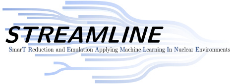

# Active learning emulators for nuclear two-body scattering in momentum space

<p>
The STREAMLINE members at Ohio U and OSU have developed an active-learning approach to snapshot selection that enables the construction of fast & accurate emulators for two-body scattering in momentum space. 

This repository accompanies our publication [Phys. Rev. C **113**, 044001](https://doi.org/10.1103/s6my-pqs9). The JAX implementation is available in [another repository](https://github.com/kim-jane/jaxem/). 

**We are working to polish both repositories. To be finished soon.**

## Cite this work

Please use the following BibTeX entry to cite our work:

```bibtex
@article{Giri:2025pkw,
    author = "Giri, A. and Kim, J. and Drischler, C. and Elster, Ch. and Furnstahl, R. J.",
    title = "{Active learning emulators for nuclear two-body scattering in momentum space}",
    eprint = "2512.17842",
    archivePrefix = "arXiv",
    primaryClass = "nucl-th",
    doi = "10.1103/s6my-pqs9",
    journal = "Phys. Rev. C",
    volume = "113",
    number = "4",
    pages = "044001",
    year = "2026"
}
```

## Contact details

Abhinav Giri (<ag086822@ohio.edu>)  
Christian Drischler (<drischler@ohio.edu>)  
Department of Physics and Astronomy   
Ohio University  
Athens, OH 45701, USA 

Christian Drischler (<drischler@ohio.edu>)  
Department of Physics and Astronomy   
Ohio University  
Athens, OH 45701, USA 
